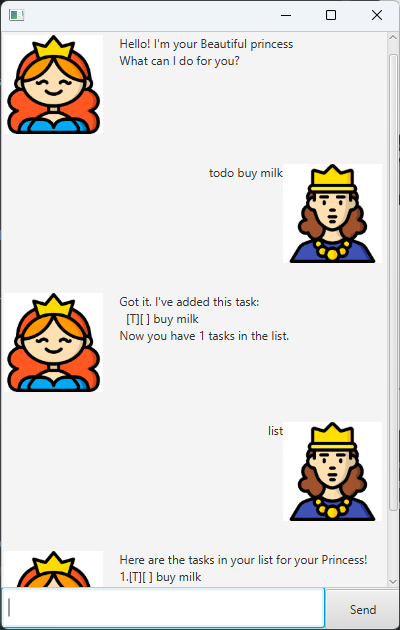

# Princess Task Manager User Guide

Princess Task Manager is your personal assistant for managing tasks effortlessly. 
Whether it’s tracking deadlines, scheduling events, or organizing your to-do list, 
this task manager keeps everything in one place with a user-friendly interface.

# Features

## List all the tasks : list
Princess will display all tasks in your task list.

format: `list`

Example

## Add todo Task : todo
Princess will add a ToDo task to your task list.

The task must have a description.
You can specify a place using /at, but /at must be at the end of the command (optional). 

Format: 
- `todo [TASKNAME]`
- `todo [TASKNAME] /at [PLACE]`

Examples: 
- `todo buy milk`
- `todo buy milk powder /at NTUC`

## Add a Deadline Task : deadline
Princess will add a Deadline task with a due date.

You must specify a /by DATE/TIME.
You can add a place using /at PLACE, but /at must be at the end (optional).

Format:
- `deadline [TASKNAME] /by [DATE_TIME]`
- `deadline [TASKNAME] /by [DATE_TIME] /at [PLACE]`

Examples:
- `deadline submit assignment /by 20 Jan 2000`
- `deadline submit assignment /by 20 Jan 2000 1400`
- `deadline submit assignment /by 20 Jan 2000 1400 /at Computing building`

## Add an Event Task : event
Princess will add an Event task that has a start and end time.

You must specify /from DATE/TIME and /to DATE/TIME.
You can add a place using /at PLACE, but /at must be at the end (optional).

- `event [TASKNAME] /from [START_DATE_TIME] /to [END_DATE_TIME]`
- `event [TASKNAME] /from [START_DATE_TIME] /to [END_DATE_TIME] /at [PLACE]`

Examples:
- `event attend meeting /from 20 Jan 2000 1000 /to 20 Jan 2000 1200`
- `event concert /from 01 June 2025 8PM /to 01 June 2025 11PM /at National Stadium`

## Mark a Task as Done : mark
Marks a specific task as done.

Format:
- `mark [TASK_INDEX]`

Examples:
- `mark 2`

## Unmark a Task (Mark as Not Done) : unmark
Unmarks a specific task (marks it as not done).

Format:
- `unmark [TASK_INDEX]`
Examples:
- `unmark 2`

## Delete a Task : delete
Removes a task from the task list.

Format:
- `delete [TASK_INDEX]`
Example:
- `delete 2`

## Find a Task by Keyword : find
Finds tasks that contain a specific keyword.

Format:
- `find [KEYWORD]`
Example:
- `find meeting`

## View Help Message : help
Displays all available commands.

Format:
- `help`

## Exit the Program : bye
Closes Princess Task Manager.

Format:
- `bye`

## Command Summary
Here are the available commands:
- list
- delete [index]
- mark [index]
- unmark [index]
- todo [taskname] /at [place]
- deadline [taskname] /by [deadline] /at [place]
- event [taskname] /from [date/time] /to [date/time] /at [place]
- find [keyword]
- bye